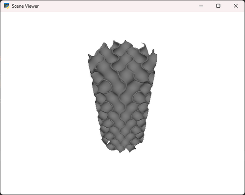
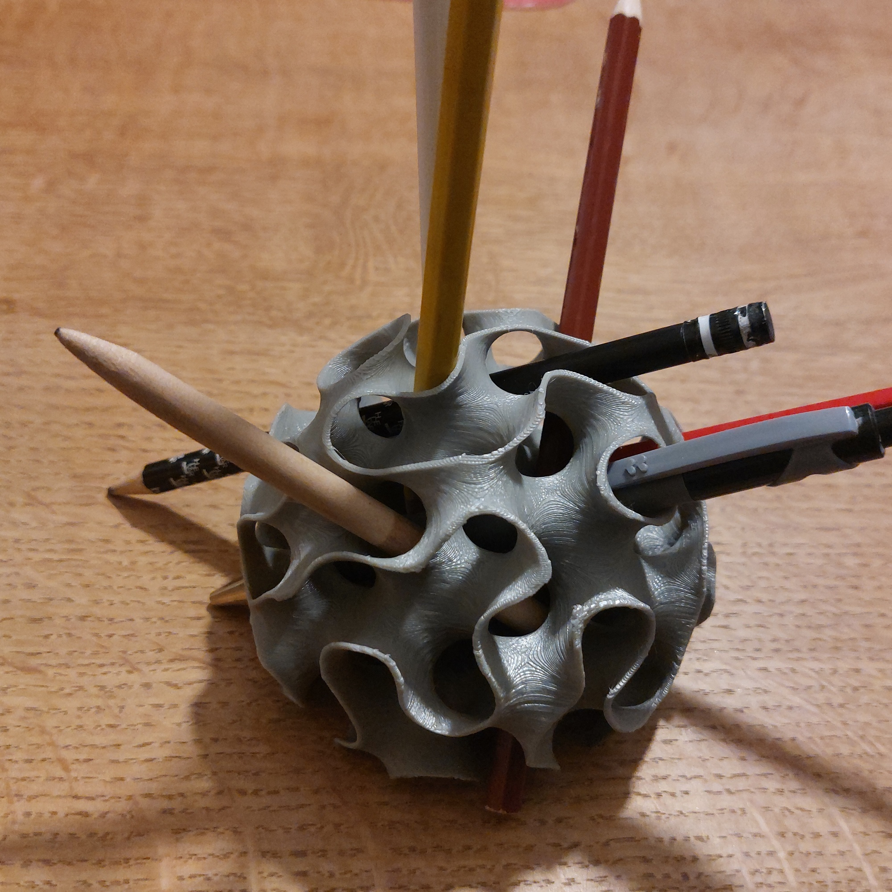
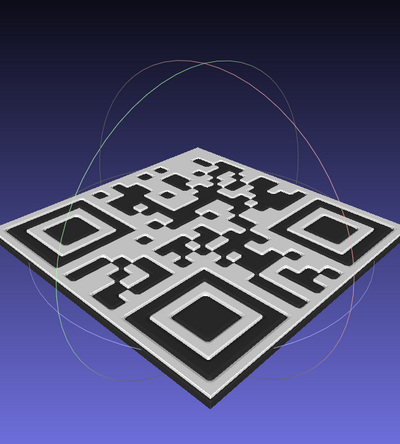

= Voxelator

basic toolkit to play with  voxels and convert to STL for 3d-print.

== tutorial

[]
----
$> git clone https://github.com/jujumo/voxelator.git
$> cd voxelator
$> pip install .
$> python ./tutorial/totem.py --verbose true --stl ./samples/totem.stl
$> python ./tutorial/sponge.py --verbose true --stl ./samples/sponge.stl
$> python ./tutorial/qrcode.py --verbose true --plate_black true ./samples/qrcode.png
----

As a result, a new version of `samples/totem.stl` should spawn and the following window should pop :

.totem: this is the interactive display activated by `--verbose true`.

.sponge: an example of a 3D printed sponge model.

.qrcode: preview of both white and black objects for a qrcode in meshlab.

You can find som of the stl files on
https://www.thingiverse.com/thing:5237274[thingiverse.com].

== note on terminology

 - voxel (grid): is a 3D grid of float numbers, stored in memory in a numpy array,
 - surface: is the (vertices, faces, normals) triplet from marching cubes,
 - mesh_o3d: mesh with open3D format
 - stl: is a file storing a mesh using stl format,
 - npy: is a file storing a numpy array file.