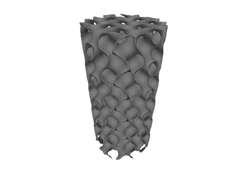
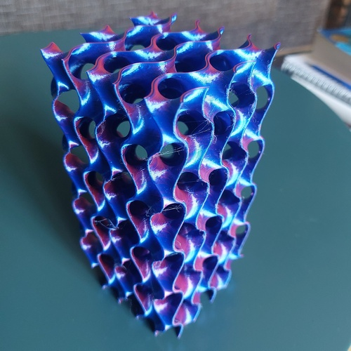
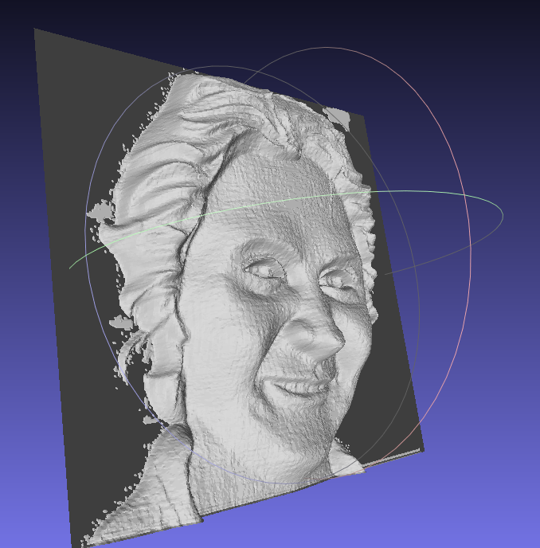
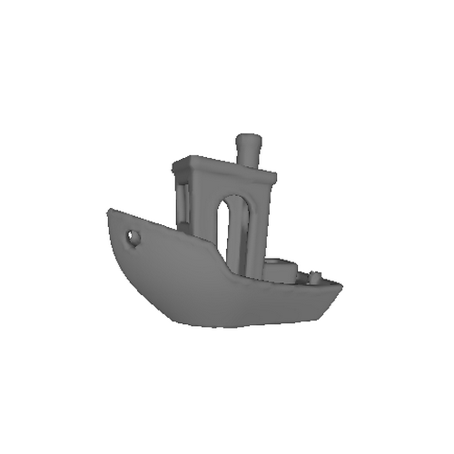

= Voxelator

basic toolkit to play with  voxels and convert to STL for 3d-print.

== install

[source,bash]
----
$> git clone https://github.com/jujumo/voxelator.git
$> cd voxelator
$> pip install .
----

== tutorials

=== gyroid

This tutorial illustrates the process of creating STL files from a mathematical function,
using the Gyroid as an example.

[source,bash]
----
$> gyroid --verbosity 1 --shape pole --size 100 --thickness 0.3 --definition 300 --periods 5.5 samples/totem.stl
----

As a result, a new version of `samples/totem.stl` should spawn and the following window should pop :

.totem: this is the interactive display activated by `--verbose true`.

[source,bash]
----
$> gyroid --verbosity 1 --shape sponge --size 80 --thickness 0.3 --definition 200 --periods 2.8 samples/sponge.stl
----

.sponge: an example of a 3D printed sponge model.

[source,bash]
----
$> gyroid --verbosity 1 --size 150 --thickness 1.2 --periods 5 --shape monolith samples/monolith.stl
----

.monolith: an example of a 3D printed monolith model.

You can find som of the stl files on
https://www.thingiverse.com/thing:5237274[thingiverse.com].

=== Elevation 2 STL

Converts a depth map (intensity = depth) to an stl file.

[source,bash]
----
$> elevation2stl -v 1 -i depthmap.png -x 100 -y 100 -z 20 -o face.stl
----

=== QRCode

This tutorial demonstrates how to convert a QR code (or any black-and-white image) into a printable STL file.
There are various options available, depending on your preferred method for printing multiple colors.

[source,bash]
----
$> qrcode --verbosity 1 --plate_black true ./samples/qrcode.png
----

.qrcode: preview of both white and black objects for a qrcode in meshlab.
image:samples/qrcode-preview.png[qrcode]

=== voxelize

First download or prepare an STL file (e.g. https://github.com/CreativeTools/3DBenchy/blob/b542785f9642ab39db8a778a0ccc934b3ebd829a/Single-part/3DBenchy.stl[3DBenchy.stl])
Then, trigger the following:

[source,bash]
----
$> voxelize --verbosity 1 ./samples/3DBenchy.stl
----

This should result in a `3DBenchy.npy` file, alongside `.stl`.

