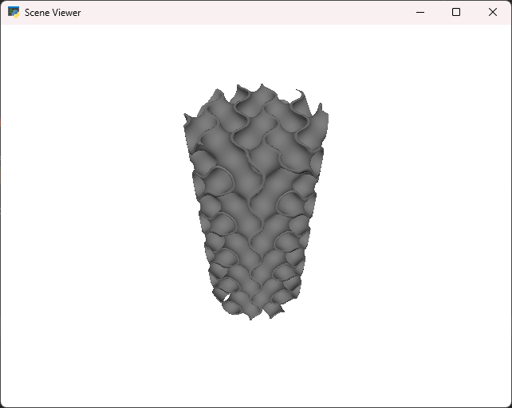

= Voxelator

basic toolkit to play with  voxels and convert to STL for 3d-print.

== tutorial

----
$> git clone https://github.com/jujumo/voxelator.git
$> cd voxelator
$> pip install .
$> python ./tutorial/totem.py --stl samples/totem.stl
Working... ━━━━━━━━━━━━━━━━━━━━━━━━━━━━━━━━━━━━━━━━ 100% 0:00:10
$> python ./tutorial/totem.py
----

As a result, a new version of `samples/totem.stl` should spawn and the following window should pop :

You can find the stl file on
https://www.thingiverse.com/thing:5237274[thingiverse.com].

== note on terminology

 - voxel (grid): is a 3D grid of float numbers, stored in memory in a numpy array,
 - surface: is the (vertices, faces, normals) triplet from marching cubes,
 - mesh_o3d: mesh with open3D format
 - stl: is a file storing a mesh using stl format,
 - npy: is a file storing a numpy array file.